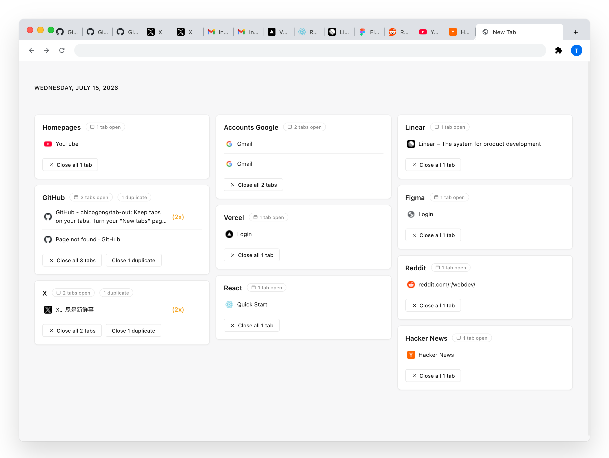

<div align="center">

# Tab Out (Minimalist Edition)

**Turn your "New Tab" page into a clean, distraction-free mission control.**



<div>
  <a href="README.md">English</a>
  <span>&nbsp;|&nbsp;</span>
  <a href="README_zh.md">简体中文</a>
</div>
<br>

[](https://opensource.org/licenses/MIT)
[](#)
[](#)

</div>

## Introduction

Tab Out is a lightweight Chrome extension that replaces your new tab page with an organized dashboard of all your open tabs. By automatically grouping tabs by domain and prioritizing homepages, it helps you regain focus and quickly triage your browser workspace. 

This repository is a **heavily customized Minimalist Edition** of the original project, redesigned with a strict "less is more" philosophy and enhanced security standards.

## Why this fork?

Compared to the upstream project, this Minimalist Edition introduces the following architectural and design changes:

- **Premium UI Redesign**: Replaced the original styling with a sleek, distraction-free monochrome aesthetic and glassmorphism components.
- **Zero Information Anxiety**: Removed peripheral features such as the "Saved for Later" sidebar and bookmark icons to maintain a pure, single-column focus layout.
- **Strict Content Security Policy (CSP)**: Refactored the core logic to eliminate all inline `onclick` and `onerror` handlers, achieving 100% compliance with strict Chrome Manifest V3 security requirements.
- **XSS Prevention**: Implemented robust HTML escaping for all dynamic tab titles and URLs to prevent Cross-Site Scripting attacks.

## Features

- **Domain-based Grouping**: Automatically organizes scattered tabs into a clean grid by domain.
- **Homepage Aggregation**: Intelligently groups frequently used web applications (Gmail, X, YouTube, GitHub, etc.) into a prioritized top card.
- **Duplicate Detection**: Flags duplicate tabs pointing to the exact same URL, enabling one-click cleanup.
- **Instant Navigation**: Click any tab title to jump directly to it across windows, preventing unnecessary new tabs.
- **Developer Friendly**: Automatically distinguishes localhost tabs by their port numbers.
- **Privacy First**: 100% local execution. No external servers, no tracking, and no data leaves your machine.
- **Zero Dependencies**: Pure vanilla JavaScript. No Node.js, no bundlers, and no setup required.

## Installation

### Manual Setup

1. **Clone the repository:**
   ```bash
   git clone https://github.com/chicogong/tab-out.git
   ```

2. **Load into Chrome:**
   - Navigate to `chrome://extensions` in your browser.
   - Enable **Developer mode** using the toggle in the top right corner.
   - Click **Load unpacked** in the top left corner.
   - Select the `extension/` directory from the cloned repository.

3. **Verify Installation:**
   - Open a new tab (Cmd/Ctrl + T). You should immediately see the Tab Out dashboard.

## Tech Stack

- **Extension API**: Chrome Manifest V3
- **Storage**: `chrome.storage.local`
- **UI & Animations**: Vanilla HTML, CSS Grid, and custom JS particle engine
- **Audio**: Web Audio API (dynamically synthesized)

## License

Released under the [MIT License](LICENSE).

<div align="center">
  <br>
  Built by <a href="https://x.com/zarazhangrui">Zara</a> | Forked & Upgraded to Minimalist Edition by <b>Chico</b>
</div>
